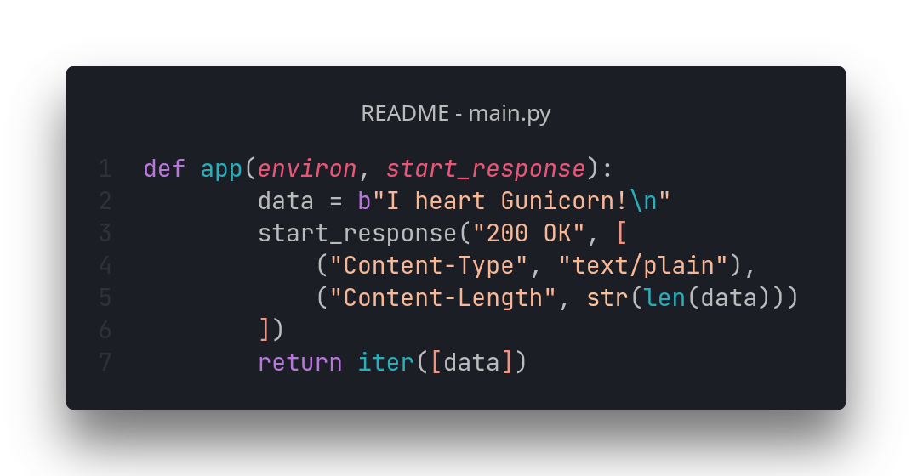

# [⏪ Go back home](readme.md)

# What is my calling?

<h1 align="center">
<a href="README_js-tab.md">JS code</a> <•>
<a href="README_rust-tab.md">Rust code</a> <•>
<a>Python code</a> <•>
<a href="README_wasm-tab.md">WebAssembly</a>
</h1>

Python!  I have been using Python practically since I started coding, and is my goto for command-line apps and shell-scripting! I have been coding in Python since essentially day 1. I remember when I was 10 I programmed an awful command-line game in Python (which I still have a copy of but REFUSE to share with anybody for the sake of my dignity as a developer).

My latest Python adventure? ~~[mafiru]()~~ \\\\Still need to upload it to Github 😅
 

Coming soon™️

 

######  Reach me on [Discord](https://www.discord.com/app)! I am @T•Ø•R•Ü•S#0361 ;)
