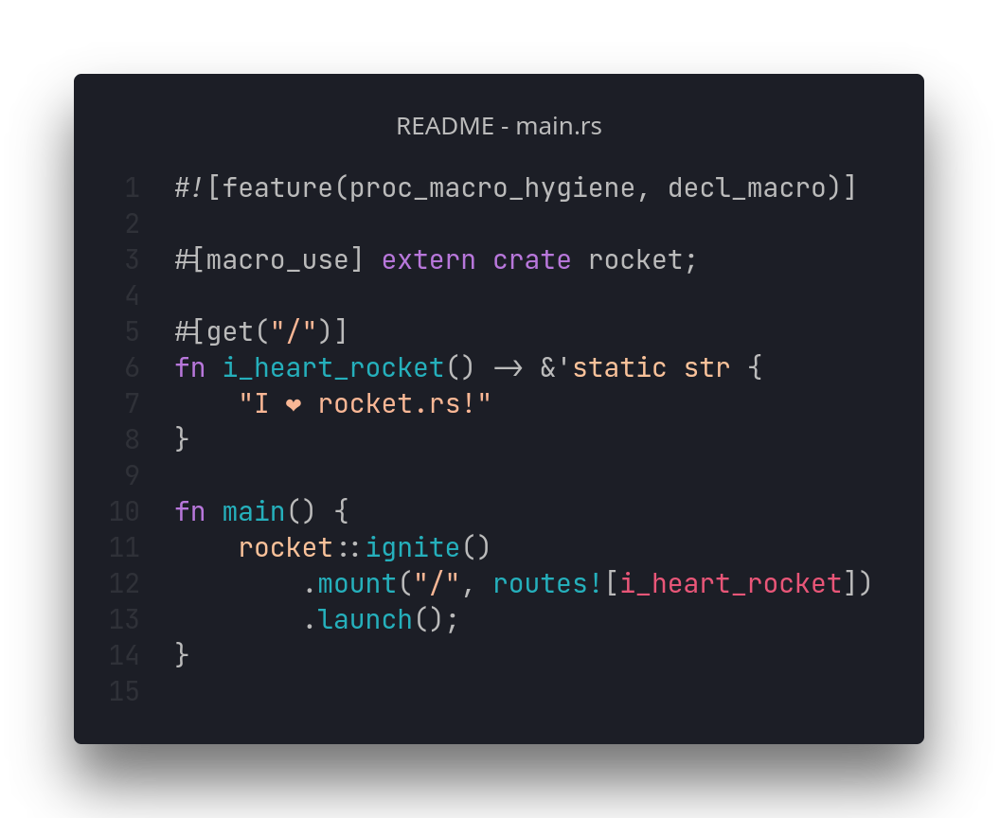

# [⏪ Go back home](readme.md)

# What is my calling?

<h1 align="center">
<a href="README_js-tab.md">JS code</a> <•>
<a>Rust code</a> <•>
<a href="README_python-tab.md">Python code</a> <•>
<a href="README_wasm-tab.md">WebAssembly</a>
</h1>

Rust!  I am an expert Rustacean -- and I'm capable of creating various types of simple, safe applications in Rust! Due to Rust's explicit error handling, my Rust apps will be rock-solid stable and super speedy due to Rust's compiler

My latest Rust adventure? [Donut Planet](https://github.com/T-O-R-U-S/donut-planet-backend), a social media service.
 

 

######  Reach me on [Discord](https://www.discord.com/app)! I am @T•Ø•R•Ü•S#4435 ;)
