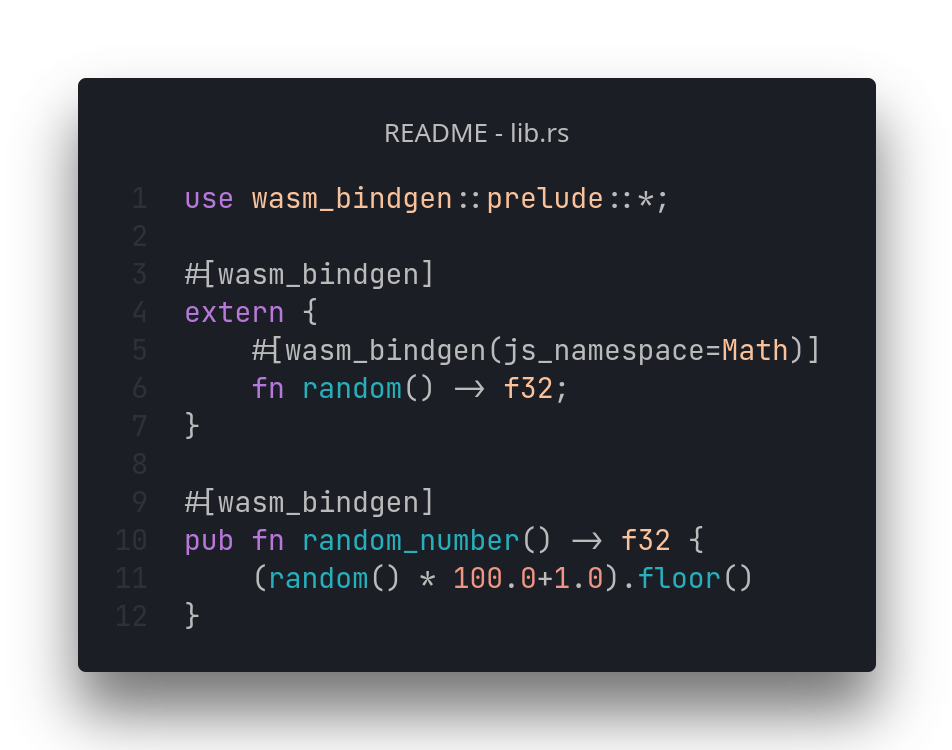
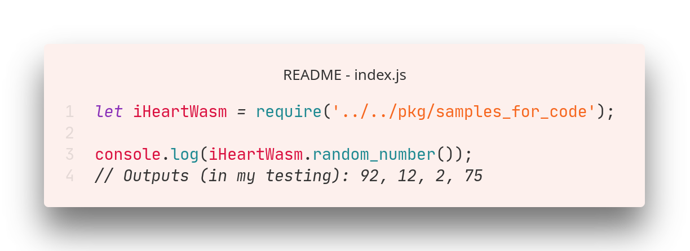

# [⏪ Go back home](readme.md)

# What is my calling?

<h1 align="center">
<a href="README_js-tab.md">JS code</a> <•>
<a href="README_rust-tab.md">Rust code</a> <•>
<a href="README_python-tab.md">Python code</a> <•>
<a>WebAssembly</a>
</h1>

WebAssembly!  Bringing the best of both worlds to action, I can combine my Rust skills with my JavaScript expertise to bring an application that runs incredibly fast behind the scenes while still being fairly high-level and maintainable! Where JavaScript is best, JavaScript/TypeScript can be applied, and where it's not, Rust can take its place.

