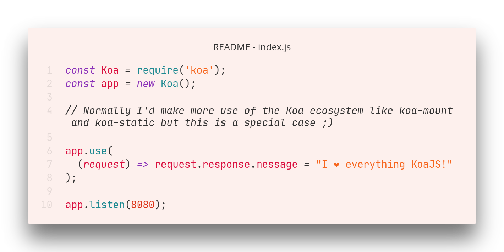

<h1 align="center"></img></h1>

 
<h2>My languages (and tools):  
<code></img></code>
<code></img></code>
<code></img></code>
<code></img></code>
<code></img></code>
<code></img></code>
<code></img></code>
<code></img></code>
<code></img></code>
</h2>

 

# What is my calling?

## **Have a taster of my back-end skills across languages!**

<h1 align="center">
<a href="README_js-tab.md">JS code</a> <•>
<a href="README_rust-tab.md">Rust code</a> <•>
<a href="README_python-tab.md">Python code</a> <•>
<a href="README_wasm-tab.md">WebAssembly</a>
</h1>

JavaScript!  All the way. I am an expert in everything JavaScript, and would love to contribute to a JavaScript open-source project! I have made several small applications to showcase my back-end JavaScript expertise. My favorite back-end NodeJS library is currently KoaJS (but I've got some express experience)!

Of course, I wouldn't want to mislead you (😅) so here is a chart to quantify how good I am at each language
|Language|Skill level|
|--------|-----------|
|JavaScript/TypeScript| ⭐⭐⭐⭐⭐|
|Python|⭐⭐⭐|
|Rust|⭐⭐|
|React/Svelte|⭐⭐⭐|
|CSS (P A I N F U L)|-⭐|

  

##### Hey! These really cool widgets on my profile were made by [Anurghazra](https://github.com/anuraghazra), check them out on Github!

# Front-end sampler coming soon! But this decent markdown (I hope) should be a good sign :)

## 📝 My top IDEs/text editors!
1. Visual Studio code! </img>
2. JetBrains WebStorm </img> (But yikes, is it expensive!)
3. NeoVim :)  </img> Nice and simple. Favorite command line application!
## ✨ Fun facts about me
- I was born in Japan 🇯🇵 which I nice, but I was there for like 3 months and I don't know any Japanese :/
- I have been programming since I was 10 years old. (It's true!) 👶
- Programming has overtaken gaming as my daily hobby. Farewell, VALORANT. 🎮 
- I made my profile picture on my own in Blender! </img>

 

> ####  Reach out to me on [Discord](https://www.discord.com/app)! I am @T•Ø•R•Ü•S#0361 ;)